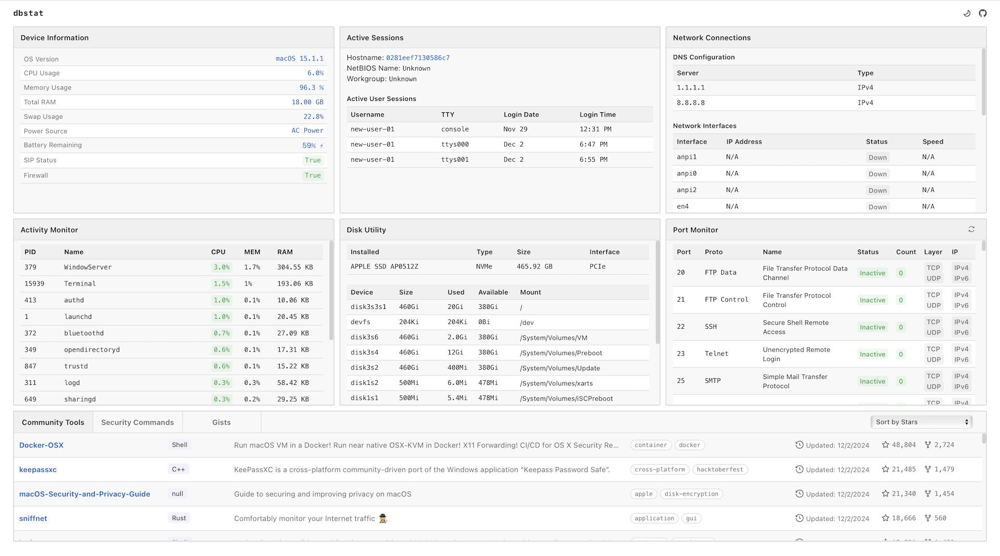

# dbstat (macOS 13.0+)

<p>A simple locally hosted dashboard to view real-time information about your Mac.</p>

## Features

- Real-time system metrics monitoring
- Process management- Network connections tracking
- Storage analytics
- Security status monitoring
- Active sessions tracking
- Dark/light theme support
- GitHub integration

## Screenshots

### Light Theme


### Dark Theme


## Requirements

- Node.js 16+
- macOS 11.0+ (Big Sur or later)
- OpenAI API key (for security commands feature)<br>

<p>&nbsp;&nbsp;&nbsp;&nbsp;Tested:<br></p>
<p>&nbsp;&nbsp;&nbsp;&nbsp;- &#x2705; Safari<br>
&nbsp;&nbsp;&nbsp;&nbsp;- &#x2705; Firefox</p>

<p>&nbsp;&nbsp;&nbsp;&nbsp;<em>Should work in all browsers</em></p>

## Installation

```bash
# Clone repository
git clone https://github.com/cgtwig/dbstat
cd dbstat

# Install dependencies
npm install

# Create and configure .env file
cp .env.example .env
```

## Configuration

Create a `.env` that looks like this:

```bash
# Server configuration
PORT=3000
HOST=127.0.0.1
CORS_ORIGIN=http://127.0.0.1:3000

# Security
JWT_SECRET=insert-jwt-token

# Security commands pane (optional)
OPENAI_API_KEY=insert-api-key
```

Easily generate a `JWT_secret` using terminal with following command (use the output for the `JWT_SECRET` value in your .env file):

```bash
node -e "console.log(require('crypto').randomBytes(32).toString('hex'))"
```

## Usage

```bash
# Launch the server and the dashboard with a single command
npm start
```

If your browser didn't open the dashboard automatically when running `npm start` simply open up a browser and view the dashboard by going to `http://localhost:3080`.


## WebSocket Events

| Event | Description |
|-------|-------------|
| `system-update` | System metrics update |
| `process-update` | Process list update |
| `network-update` | Network stats update |
| `storage-update` | Storage info update |

## API Routes

```
GET  /api/get-token         # Get WebSocket auth token
POST /api/security-commands # Get security commands
```

## Dependencies

- express
- socket.io
- systeminformation
- jsonwebtoken
- helmet
- dotenv

## License

MIT
