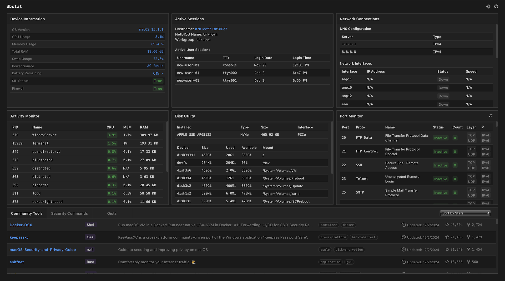

## dbstat (macOS 13.0+)

A simple locally hosted dashboard to view real-time information about your Mac.  
This project is **open source** and welcomes contributions from the community.


### Features

- Real-time system metrics monitoring  
- Process management  
- Network connections tracking  
- Storage analytics  
- Security status monitoring  
- Active sessions tracking  
- Dark/light theme support  
- GitHub integration  

### Screenshots

  
*Light Theme*

  
*Dark Theme*

### Requirements

- **Node.js**: 16+  
- **macOS**: 11.0+ (Big Sur or later)  

### Browsers Tested

- ✅ Safari  
- ✅ Firefox  

### Dependencies

- express `[4.17.1]`  
- socket.io `[4.8.1]`  
- systeminformation `[5.11.9]`  
- jsonwebtoken `[9.0.2]`  
- helmet `[8.0.0]`  
- dotenv `[16.0.0]`  

### Optional

This app by default includes a tab at the bottom of the page that makes use of the Open AI API to generate some example commands.  
To enable this feature, just add your Open AI API key in the `.env` file as:  
`OPEN_AI_API=YOUR_KEY_GOES_HERE`  

**Note**: If you enter your OpenAI API key, the app makes just one API call using `gpt-4o-mini` on load.  
The 'regenerate' button will make a new API call each time you click it.  

### Installation

```bash
# Clone repository
git clone https://github.com/cgtwig/dbstat
cd dbstat

# Install dependencies
npm install

# Create and configure .env file
cp .env.example .env
```  

### Configuration

Create a `.env` file with the following content:

```bash
# Server configuration
PORT=3000
HOST=127.0.0.1
CORS_ORIGIN=http://127.0.0.1:3000

# Security
JWT_SECRET=insert-jwt-token

# Security commands pane (optional)
OPENAI_API_KEY=insert-api-key
```

To generate a `JWT_SECRET`, use the following command in your terminal:

```bash
node -e "console.log(require('crypto').randomBytes(32).toString('hex'))"
```  

### Usage

```bash
# Launch the server and the dashboard with a single command
npm start
```

If the dashboard doesn't open automatically, go to `http://localhost:3000` in your browser.  

### WebSocket Events

| Event            | Description              |  
|------------------|--------------------------|  
| `system-update`  | System metrics update    |  
| `process-update` | Process list update      |  
| `network-update` | Network stats update     |  
| `storage-update` | Storage info update      |  

### API Routes

```bash
GET  /api/get-token         # Get WebSocket auth token  
POST /api/security-commands # Get security commands  
```  

### License

This project is licensed under the MIT License and is **open source**. Contributions are welcome!

#macOS #dashboard #opensource #free #monitoring #metrics #networking #tracking #analytics #security #nodejs #spa #websocket #stats #data #mac-dashboard
